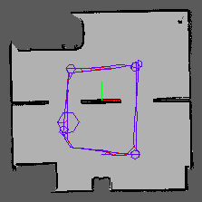
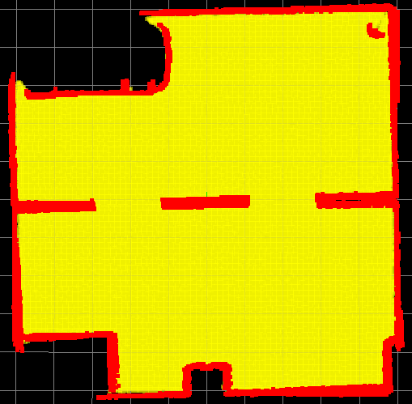

# Intro
These are the projects for the Udacity Robotics Software Engineer Nanodegree Program. Please clone the repo into the `src` folder of your workspace with the `--recursive` switch. It was built with ROS Kinetic.

# Build My World
Everything except the plugin are used in later projects; this is included for completeness.  
The plugin is built as follows (instructions from Udacity lesson):  
$ `cd /home/workspace/build_my_world`  
$ `mkdir build`  
$ `cd build/`  
$ `cmake ../`  
$ `make # You might get errors if your system is not up to date!`  
$ `export GAZEBO_PLUGIN_PATH=${GAZEBO_PLUGIN_PATH}:/home/workspace/myrobot/build`  

Run with `gazebo build_my_world/world/the_office.world`  

# Go Chase It!
The `ball_chaser` package makes the robot move toward the white ball by checking the camera input for white pixels, and aims for the midpoint of the leftmost and rightmost found. Start with:  
`roslaunch my_robot world.launch`  
`roslaunch ball_chaser ball_chaser.launch`  

# Where Am I?
Uses the Map Server, ACML, and Move Base packages to help localize and navigate.  
Launch Gazebo and Rviz with:  
`roslaunch my_robot world.launch`  

Launch Map Server, ACML, and Move Base with:  
`roslaunch my_robot acml.launch`  

Optionally, start teleop with:  
`rosrun teleop_twist_keyboard teleop_twist_keyboard.py`  

# Map My World
This project uses `rtabmap_ros` to map out the environment (using a smaller world than before to simplify the process). Start the world and move the robot around with `teleop` :  
`roslaunch my_robot mini_world.launch`  
`roslaunch my_robot mapping.launch`  
`roslaunch my_robot teleop.launch`  

This image shows the route taken and the resulting map.  

Here's the 3D map.

And here's the occupancy map.

The resulting database is available [here](https://drive.google.com/file/d/1iyAVE3LfqA92Yvxj8nCyixcxft3ElnlB/view?usp=sharing), and can be put in `my_robot/maps/rtabmap.db` to  be used for localization, similar to the *Where Am I?* project.  
`roslaunch my_robot world.launch`  
`roslaunch my_robot localization.launch`  
`roslaunch my_robot teleop.launch`  

# Home Service Robot
This project uses the `turtlebot` and `slam_gmapping` packages for localization and mapping. `add_markers` places and removes RVIZ marker visualizations, which are triggered by `pick_objects` controlling the robot's movement.

### Mapping
Test: `./scripts/test_slam.sh`  
Here's the map produced by navigating with the `slam_gmapping` package.

### Localization and Navigation
Test: `./scripts/test_navigation.sh`  
Send robot to pickup/dropoff:  `./scripts/pick_objects.sh`  

### Home Service Functions
Test: `./scripts/add_marker.sh`  
Put it all together:  `./scripts/home_service.sh`  
